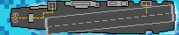
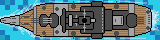
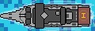
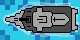

###  General Assembly, Software Engineering Immersive
# BATTLESHIPS 

## Overview
This was my first front-end development project, created as part of General Assembly's Software Engineering Immersive bootcamp.

My task was to create a grid-based game renderd in the browser that utilised Javascript, HTML and CSS. I decided to create an online version of the classic game Battleships. 

Try it out [here](https://jamesnicholasryan.github.io/Battleships/)! 

The game was to be created as a solo project and completed within one week.


## Brief
- **Render a game in the browser**
- **Design logic for winning** & **visually display which player won**
- **Include separate HTML / CSS / JavaScript files**
- Stick with **KISS (Keep It Simple Stupid)** and **DRY (Don't Repeat Yourself)** principles
- Use **Javascript** for **DOM manipulation**
- **The game should be one player, with the computer placing its pieces randomly at the start of the game**
- **The computer should be able to make random attacks on the player's board**

When I had a basic game complete, I aimed for these extra goals:
- Responsive design, for mobile and web
- More intelligent attacks by the computer
- Visual enhancements (ship indicators etc.)

## Technologies used
- Javascript (ES6)
- HTML5
- CSS
- Pro Tools (for SFX editing and mixing)
- GIMP (for pixel art and details)
- Git & GitHub


# Approach

## Planning
Before writing a single line of code, I planned extensively for the week ahead. I outlined the core foundations of the game I would like to make by the end of the week:
- There will be two boards, one for the player and one for the computer.
- The game will have **three stages**: *preparation stage*, *attacking phase* & *end game*
  - During the **preparation phase**, the player will place ships (ships must be able to rotate). The computer will place ships randomly during this phase, without collision or overlapping. 
  - The **attacking phase** will start once all ships are placed. In this pahse the players take turns to attack cells on each other's boards.
  - When either players ships are all destroyed, the game **ends**


## Grid
At the heart of the game is the grid system, where all of the action takes place. For the grid layout I decided to proceed with a *cartesian* type coordinate system, with the origin at the top left of the grid. This would make searching for neighbouring cells and position much easier than a simple list of cells. Each cell was assigned an *ID* that corresponded of - 'board number', 'column' ('j') and 'row' ('i').

- I created a **Board** *class* which contains this *display* method:
```js
  display() {
    const gridId = '#grid' + this.boardNum
    const grid = document.querySelector(gridId)
    for (let i = 1; i < this.rows + 1; i++) {
      for (let j = 1; j < this.columns + 1; j++) {
        const cell = document.createElement('div')
        const cellID = this.boardNum + ',' + j + ',' + i + ''
        cell.id = cellID
        if (this.boardNum === 1) {                        
          cell.classList.add('cell')
        } else if (this.boardNum === 2) {
          cell.classList.add('blackCell')
        }
        grid.appendChild(cell)
        this.cells.push(cell)
        cell.style.width = `${100 / this.width}%`
        cell.style.height = `${100 / this.width}%`
      }
    }
  }
```


## Preparation Phase
To allow for dynamic rotation and placement of the ships, I decided to create a **Ship** *class*. Each **Ship** has 7 keys: *type*, *name*, *poisition*, *rotation*, *bodyCells*, *lives* and *board*.

(All ship pixel art was created by me, in the open-source graphics editor GIMP)         






- When called apon, each ship has a method that works out the correct orientation and placement of the ships *body cells*, depending on their *position* & *type* (length):
```js
 createBodyCells(position) {                  
    this.bodyCells = [] 
    this.bodyCells.push(position) 
    const splitPosition = position.split(',')
    for (let i = 1; i < this.type; i++) {   
      if (this.rotation === false) {   
        splitPosition[1] ++                         
        this.bodyCells.push(splitPosition.join(','))
      } else {                            
        splitPosition[2] ++
        this.bodyCells.push(splitPosition.join(','))
      }
    }
  }
```

- As with the **Board** class, each **Ship** has a *display* method, which contains collision checks for the edges and other ships. I used an array called 'fullCells' to determine which cells had ships in them:
```js
  const cellCoordsSlpit = this.bodyCells.toString().split(',')
  const outOfBounds = cellCoordsSlpit.some((cell) => {
    return (cell > 10 || cell < 1) 
  })
  const collision = this.bodyCells.some((shipBlock) => {      
    return fullCells.includes(shipBlock)
  })
```

Ship placement for the AI is exactly the same as the players', however, the process is completely random - if the computer comes across collisions, the AI will repeat the methods until no collisions are found:

- I have a *const* **displayCounter2** that keeps track of which ships are being placed - while this counter is larger than *zero*, the AI repeats the staging pahse:
```js
function computerStage() {
  let availableCells = []
  boardTwo.cells.forEach((cell) => availableCells.push(cell))                    
  const randomNum = Math.round(Math.random() * (availableCells.length - 1))
  const randomCell = availableCells[randomNum]
  const randomCellId = randomCell.id
  const randomRotation = Math.round(Math.random() * 1) + 1 
  rotateShips(randomRotation)
  arrayOfShips2[displayCounter2].display(randomCellId, 'placement')  
  availableCells = availableCells.filter((cell) => {   
    return cell !== randomCell
  })
  while (displayCounter2 >= 0) { 
    computerStage()
  }
}
```

## Attack Phase (computer logic)

To alternate turns, essentially switching between the boards, I used a **blocking div** to cover each board when necessary. To *block* a board, I changed the z-index of the *div* so that it would be above the board in question - this blocking any attempts at *clicking*/*hovering*: 
```js
    zAxisBlocker2.classList.remove('zAxisOn')
    zAxisBlocker1.classList.add('zAxisOn')
```
Once I had succesfully created a randomly attacking AI, I set to task with creating a more intelligent targetting system. The essence of this logic is as follows: 
  1. The computer player targets the player board randomly, repeating each turn until it gets a direct **HIT** on an enemy ship
  2. At that moment, the computer creates a **frontier** array filling it with neighbouring cells (up, right, down, left)  
  3. Next turn, instead of attacking randomly, the computer targets the first cell in the **frontier** array (removing it from the array too!).
  4. If this attack is a **HIT**, then add the next cell (*in the same direction of attack*) to the FRONT of the frontier array
  5. Repeat step 3 until the **frontier** is empty.

- Here is the first half of my **aIAttack** *function* that shows the code for step 2:
```js
function aIAttack(cellId) {
  if (frontier.length === 0) { 
    if (hit === true) {   
      homeCell = []
      homeCell.push(cellId) 
      const idSplit = cellId.split(',')
      const idSplitX = parseInt(idSplit[1]) 
      const idSplitY = parseInt(idSplit[2])
      const top = '1,' + (idSplitX) + ',' + (idSplitY - 1)  
      const right = '1,' + (idSplitX + 1) + ',' + (idSplitY)
      const bottom = '1,' + idSplitX + ',' + (idSplitY + 1)
      const left = '1,' + (idSplitX - 1) + ',' + idSplitY
      frontier.push(top, right, bottom, left)   
      frontier.forEach((cell) => {
        if ((cell.split(',').some((num) => (num > 10) || (num < 1)))) { 
          frontier.splice(frontier.indexOf(cell), 1)   
        }
        if (unavailableCells.includes(cell)) {
          frontier.splice(frontier.indexOf(cell), 1)
        }
      })
    } else {
      const announcement = 'COMPUTER HAS MISSED ... AND IS VERY SAD :('
      flashText(announcement, infoBar2, 10)
    }
    // ...
```
To utilise the logic in step 4, I created a function called **directionFinder**. This function will calculate the direction the computer is currently attacking in relation to the *home cell* (The home cell is the saved durng step 2 - being the first cell *HIT*). This direction is saved in a variable called **XorY** - 0 being UPWARDS, 1 being RIGHT, 2 being DOWNWARDS and 3 being LEFT. With this information, the computer can add the next cell along in the chain of *HITS*.

```js
function directionFinder() {    
  if (frontier.length > 0) {
    const directionCellToAttackSplit = frontier[0].split(',') 
    const homeCellarray = homeCell[0]
    const homeCellSplit = homeCellarray.split(',')
    const homeCellX = homeCellSplit[1]
    const homeCellY = homeCellSplit[2]
    diffX = parseInt(homeCellX) - parseInt(directionCellToAttackSplit[1])
    diffY = parseInt(homeCellY) - parseInt(directionCellToAttackSplit[2])
    if (diffX === 0) { 
      if (diffY > 0) {  
        xOrY = 0
      } else if (diffY < 0) { 
        xOrY = 2
      }
    } else if (diffY === 0) {
      if (diffX > 0) {
        xOrY = 3
      } else if (diffX < 0) {
        xOrY = 1
      }
    }
  }
}
```

This logic has some flaws, but it is a massive improvement to the randomly attacking AI. An even more refined tactic is to restrict the available cells in the initial attacks. Instead of every cell, every OTHER cell on the board is targetted thus avoiding wasted attacks in cells that can't possibly hold the smallest variant of the available ships (2 cells long).

- Below is the loop I used to create this chequered board or targets. The array **notAttackedFiltered** is the array I feed to the computer for **step 1** of the AI logic:
```js
  let counter = 0
  for (i=0; i<100; i+=2) {
    if (counter === 5) {
      i++
    } else if (counter === 10) {
      counter = 0
      i--
    }
    counter ++
    notAttackedFiltered.push(notAttacked[i])d'
  }
```